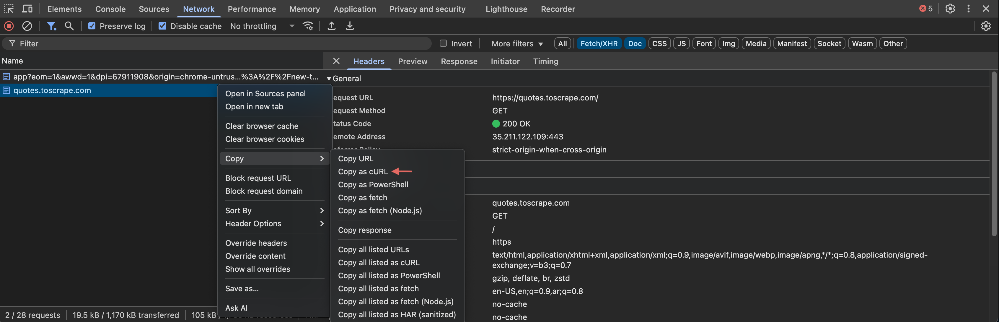

# Scrapling Interactive Shell Guide

<script src="https://asciinema.org/a/736339.js" id="asciicast-736339" async data-autoplay="1" data-loop="1" data-cols="225" data-rows="40" data-start-at="00:06" data-speed="1.5" data-theme="tango"></script>

**Powerful Web Scraping REPL for Developers and Data Scientists**

The Scrapling Interactive Shell is an enhanced IPython-based environment designed specifically for Web Scraping tasks. It provides instant access to all Scrapling features, clever shortcuts, automatic page management, and advanced tools, such as conversion of the curl command.

!!! success "Prerequisites"

    1. You've completed or read the [Fetchers basics](../fetching/choosing.md) page to understand what the [Response object](../fetching/choosing.md#response-object) is and which fetcher to use.
    2. You've completed or read the [Querying elements](../parsing/selection.md) page to understand how to find/extract elements from the [Selector](../parsing/main_classes.md#selector)/[Response](../fetching/choosing.md#response-object) object.
    3. You've completed or read the [Main classes](../parsing/main_classes.md) page to know what properties/methods the [Response](../fetching/choosing.md#response-object) class is inheriting from the [Selector](../parsing/main_classes.md#selector) class.
    4. You've completed or read at least one page from the fetchers section to use here for requests: [HTTP requests](../fetching/static.md), [Dynamic websites](../fetching/dynamic.md), or [Dynamic websites with hard protections](../fetching/stealthy.md).


## Why use the Interactive Shell?

The interactive shell transforms web scraping from a slow script-and-run cycle into a fast, exploratory experience. It's perfect for:

- **Rapid prototyping**: Test scraping strategies instantly
- **Data exploration**: Interactively navigate and extract from websites  
- **Learning Scrapling**: Experiment with features in real-time
- **Debugging scrapers**: Step through requests and inspect results
- **Converting workflows**: Transform curl commands from browser DevTools to a Fetcher request in a one-liner

## Getting Started

### Launch the Shell

```bash
# Start the interactive shell
scrapling shell

# Execute code and exit (useful for scripting)
scrapling shell -c "get('https://quotes.toscrape.com'); print(len(page.css('.quote')))"

# Set logging level
scrapling shell --loglevel info
```

Once launched, you'll see the Scrapling banner and can immediately start scraping as the video above shows:

```python
# No imports needed - everything is ready!
>>> get('https://news.ycombinator.com')

>>> # Explore the page structure
>>> page.css('a')[:5]  # Look at first 5 links

>>> # Refine your selectors
>>> stories = page.css('.titleline>a')
>>> len(stories)
30

>>> # Extract specific data
>>> for story in stories[:3]:
...     title = story.text
...     url = story['href']
...     print(f"{title}: {url}")

>>> # Try different approaches
>>> titles = page.css('.titleline>a::text')  # Direct text extraction
>>> urls = page.css('.titleline>a::attr(href)')  # Direct attribute extraction
```

## Built-in Shortcuts

The shell provides convenient shortcuts that eliminate boilerplate code:

- **`get(url, **kwargs)`** - HTTP GET request (instead of `Fetcher.get`)
- **`post(url, **kwargs)`** - HTTP POST request (instead of `Fetcher.post`)
- **`put(url, **kwargs)`** - HTTP PUT request (instead of `Fetcher.put`)
- **`delete(url, **kwargs)`** - HTTP DELETE request (instead of `Fetcher.delete`)
- **`fetch(url, **kwargs)`** - Browser-based fetch (instead of `DynamicFetcher.fetch`) 
- **`stealthy_fetch(url, **kwargs)`** - Stealthy browser fetch (instead of `StealthyFetcher.fetch`)

The most commonly used classes are automatically available without any import, including `Fetcher`, `AsyncFetcher`, `DynamicFetcher`, `StealthyFetcher`, and `Selector`.

### Smart Page Management

The shell automatically tracks your requests and pages:

- **Current Page Access**

    The `page` and `response` commands are automatically updated with the last fetched page:
    
    ```python
    >>> get('https://quotes.toscrape.com')
    >>> # 'page' and 'response' both refer to the last fetched page
    >>> page.url
    'https://quotes.toscrape.com'
    >>> response.status  # Same as page.status
    200
    ```

- **Page History**

    The `pages` command keeps track of the last five pages (it's a `Selectors` object):
    
    ```python
    >>> get('https://site1.com')
    >>> get('https://site2.com') 
    >>> get('https://site3.com')
    
    >>> # Access last 5 pages
    >>> len(pages)  # `Selectors` object with `page` history
    3
    >>> pages[0].url  # First page in history
    'https://site1.com'
    >>> pages[-1].url  # Most recent page
    'https://site3.com'
    
    >>> # Work with historical pages
    >>> for i, old_page in enumerate(pages):
    ...     print(f"Page {i}: {old_page.url} - {old_page.status}")
    ```

## Additional helpful commands

### Page Visualization

View scraped pages in your browser:

```python
>>> get('https://quotes.toscrape.com')
>>> view(page)  # Opens the page HTML in your default browser
```

### Curl Command Integration

The shell provides a few functions to help you convert curl commands from the browser DevTools to `Fetcher` requests: `uncurl` and `curl2fetcher`.

First, you need to copy a request as a curl command like the following:



- **Convert Curl command to Request Object**

    ```python
    >>> curl_cmd = '''curl 'https://scrapling.requestcatcher.com/post' \
    ...   -X POST \
    ...   -H 'Content-Type: application/json' \
    ...   -d '{"name": "test", "value": 123}' '''
    
    >>> request = uncurl(curl_cmd)
    >>> request.method
    'post'
    >>> request.url
    'https://scrapling.requestcatcher.com/post'
    >>> request.headers
    {'Content-Type': 'application/json'}
    ```

- **Execute Curl Command Directly**

    ```python
    >>> # Convert and execute in one step
    >>> curl2fetcher(curl_cmd)
    >>> page.status
    200
    >>> page.json()['json']
    {'name': 'test', 'value': 123}
    ```

### IPython Features

The shell inherits all IPython capabilities:

```python
>>> # Magic commands
>>> %time page = get('https://example.com')  # Time execution
>>> %history  # Show command history
>>> %save filename.py 1-10  # Save commands 1-10 to file

>>> # Tab completion works everywhere
>>> page.c<TAB>  # Shows: css, cookies, headers, etc.
>>> Fetcher.<TAB>  # Shows all Fetcher methods

>>> # Object inspection
>>> get? # Show get documentation
```

## Examples

Here are a few examples generated via AI:

#### E-commerce Data Collection

```python
>>> # Start with product listing page
>>> catalog = get('https://shop.example.com/products')

>>> # Find product links
>>> product_links = catalog.css('.product-link::attr(href)')
>>> print(f"Found {len(product_links)} products")

>>> # Sample a few products first
>>> for link in product_links[:3]:
...     product = get(f"https://shop.example.com{link}")
...     name = product.css('.product-name::text').get('')
...     price = product.css('.price::text').get('')
...     print(f"{name}: {price}")

>>> # Scale up with sessions for efficiency
>>> from scrapling.fetchers import FetcherSession
>>> with FetcherSession() as session:
...     products = []
...     for link in product_links:
...         product = session.get(f"https://shop.example.com{link}")
...         products.append({
...             'name': product.css('.product-name::text').get(''),
...             'price': product.css('.price::text').get(''),
...             'url': link
...         })
```

#### API Integration and Testing

```python
>>> # Test API endpoints interactively
>>> response = get('https://jsonplaceholder.typicode.com/posts/1')
>>> response.json()
{'userId': 1, 'id': 1, 'title': 'sunt aut...', 'body': 'quia et...'}

>>> # Test POST requests
>>> new_post = post('https://jsonplaceholder.typicode.com/posts', 
...                 json={'title': 'Test Post', 'body': 'Test content', 'userId': 1})
>>> new_post.json()['id']
101

>>> # Test with different data
>>> updated = put(f'https://jsonplaceholder.typicode.com/posts/{new_post.json()["id"]}',
...               json={'title': 'Updated Title'})
```

## Getting Help

If you need help other than what is available in-terminal, you can:

- [Scrapling Documentation](https://scrapling.readthedocs.io/)
- [Discord Community](https://discord.gg/EMgGbDceNQ)
- [GitHub Issues](https://github.com/D4Vinci/Scrapling/issues)  

And that's it! Happy scraping! The shell makes web scraping as easy as a conversation.