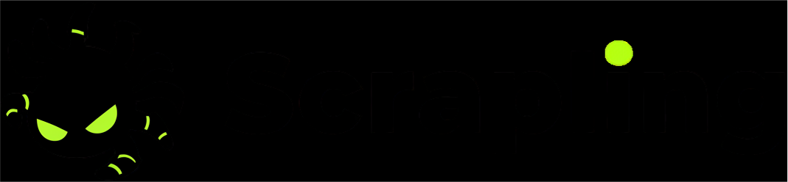

<style>
.md-typeset h1 {
  display: none;
}
[data-md-color-scheme="default"] .only-dark { display: none; }
[data-md-color-scheme="slate"] .only-light { display: none; }
</style>

<br/>
<div align="center">
    <a href="https://scrapling.readthedocs.io/en/latest/" alt="poster">
        
        
    </a>
</div>

<h2 align="center"><i>Effortless Web Scraping for the Modern Web</i></h2><br>

Scrapling is an adaptive Web Scraping framework that handles everything from a single request to a full-scale crawl.

Its parser learns from website changes and automatically relocates your elements when pages update. Its fetchers bypass anti-bot systems like Cloudflare Turnstile out of the box. And its spider framework lets you scale up to concurrent, multi-session crawls with pause/resume and automatic proxy rotation — all in a few lines of Python. One library, zero compromises.

Blazing fast crawls with real-time stats and streaming. Built by Web Scrapers for Web Scrapers and regular users, there's something for everyone.

```python
from scrapling.fetchers import Fetcher, StealthyFetcher, DynamicFetcher
StealthyFetcher.adaptive = True
page = StealthyFetcher.fetch('https://example.com', headless=True, network_idle=True)  # Fetch website under the radar!
products = page.css('.product', auto_save=True)                                        # Scrape data that survives website design changes!
products = page.css('.product', adaptive=True)                                         # Later, if the website structure changes, pass `adaptive=True` to find them!
```
Or scale up to full crawls
```python
from scrapling.spiders import Spider, Response

class MySpider(Spider):
  name = "demo"
  start_urls = ["https://example.com/"]

  async def parse(self, response: Response):
      for item in response.css('.product'):
          yield {"title": item.css('h2::text').get()}

MySpider().start()
```

## Top Sponsors 

<!-- sponsors -->
<div style="text-align: center;">
    <a href="https://www.scrapeless.com/en?utm_source=official&utm_term=scrapling" target="_blank" title="Effortless Web Scraping Toolkit for Business and Developers"></a>
    <a href="https://www.thordata.com/?ls=github&lk=github" target="_blank" title="Unblockable proxies and scraping infrastructure, delivering real-time, reliable web data to power AI models and workflows."></a>
    <a href="https://evomi.com?utm_source=github&utm_medium=banner&utm_campaign=d4vinci-scrapling" target="_blank" title="Evomi is your Swiss Quality Proxy Provider, starting at $0.49/GB"></a>
    <a href="https://serpapi.com/?utm_source=scrapling" target="_blank" title="Scrape Google and other search engines with SerpApi"></a>
    <a href="https://visit.decodo.com/Dy6W0b" target="_blank" title="Try the Most Efficient Residential Proxies for Free"></a>
    <a href="https://petrosky.io/d4vinci" target="_blank" title="PetroSky delivers cutting-edge VPS hosting."></a>
    <a href="https://hasdata.com/?utm_source=github&utm_medium=banner&utm_campaign=D4Vinci" target="_blank" title="The web scraping service that actually beats anti-bot systems!"></a>
    <a href="https://hypersolutions.co/?utm_source=github&utm_medium=readme&utm_campaign=scrapling" target="_blank" title="Bot Protection Bypass API for Akamai, DataDome, Incapsula & Kasada"></a>
</div>
<!-- /sponsors -->

<i><sub>Do you want to show your ad here? Click [here](https://github.com/sponsors/D4Vinci/sponsorships?tier_id=435495) and enjoy the rest of the perks!</sub></i>

## Key Features

### Spiders — A Full Crawling Framework
- 🕷️ **Scrapy-like Spider API**: Define spiders with `start_urls`, async `parse` callbacks, and `Request`/`Response` objects.
- ⚡ **Concurrent Crawling**: Configurable concurrency limits, per-domain throttling, and download delays.
- 🔄 **Multi-Session Support**: Unified interface for HTTP requests, and stealthy headless browsers in a single spider — route requests to different sessions by ID.
- 💾 **Pause & Resume**: Checkpoint-based crawl persistence. Press Ctrl+C for a graceful shutdown; restart to resume from where you left off.
- 📡 **Streaming Mode**: Stream scraped items as they arrive via `async for item in spider.stream()` with real-time stats — ideal for UI, pipelines, and long-running crawls.
- 🛡️ **Blocked Request Detection**: Automatic detection and retry of blocked requests with customizable logic.
- 📦 **Built-in Export**: Export results through hooks and your own pipeline or the built-in JSON/JSONL with `result.items.to_json()` / `result.items.to_jsonl()` respectively.

### Advanced Websites Fetching with Session Support
- **HTTP Requests**: Fast and stealthy HTTP requests with the `Fetcher` class. Can impersonate browsers' TLS fingerprint, headers, and use HTTP/3.
- **Dynamic Loading**: Fetch dynamic websites with full browser automation through the `DynamicFetcher` class supporting Playwright's Chromium and Google's Chrome.
- **Anti-bot Bypass**: Advanced stealth capabilities with `StealthyFetcher` and fingerprint spoofing. Can easily bypass all types of Cloudflare's Turnstile/Interstitial with automation.
- **Session Management**: Persistent session support with `FetcherSession`, `StealthySession`, and `DynamicSession` classes for cookie and state management across requests.
- **Proxy Rotation**: Built-in `ProxyRotator` with cyclic or custom rotation strategies across all session types, plus per-request proxy overrides.
- **Domain Blocking**: Block requests to specific domains (and their subdomains) in browser-based fetchers.
- **Async Support**: Complete async support across all fetchers and dedicated async session classes.

### Adaptive Scraping & AI Integration
- 🔄 **Smart Element Tracking**: Relocate elements after website changes using intelligent similarity algorithms.
- 🎯 **Smart Flexible Selection**: CSS selectors, XPath selectors, filter-based search, text search, regex search, and more.
- 🔍 **Find Similar Elements**: Automatically locate elements similar to found elements.
- 🤖 **MCP Server to be used with AI**: Built-in MCP server for AI-assisted Web Scraping and data extraction. The MCP server features powerful, custom capabilities that leverage Scrapling to extract targeted content before passing it to the AI (Claude/Cursor/etc), thereby speeding up operations and reducing costs by minimizing token usage. ([demo video](https://www.youtube.com/watch?v=qyFk3ZNwOxE))

### High-Performance & battle-tested Architecture
- 🚀 **Lightning Fast**: Optimized performance outperforming most Python scraping libraries.
- 🔋 **Memory Efficient**: Optimized data structures and lazy loading for a minimal memory footprint.
- ⚡ **Fast JSON Serialization**: 10x faster than the standard library.
- 🏗️ **Battle tested**: Not only does Scrapling have 92% test coverage and full type hints coverage, but it has been used daily by hundreds of Web Scrapers over the past year.

### Developer/Web Scraper Friendly Experience
- 🎯 **Interactive Web Scraping Shell**: Optional built-in IPython shell with Scrapling integration, shortcuts, and new tools to speed up Web Scraping scripts development, like converting curl requests to Scrapling requests and viewing requests results in your browser.
- 🚀 **Use it directly from the Terminal**: Optionally, you can use Scrapling to scrape a URL without writing a single line of code!
- 🛠️ **Rich Navigation API**: Advanced DOM traversal with parent, sibling, and child navigation methods.
- 🧬 **Enhanced Text Processing**: Built-in regex, cleaning methods, and optimized string operations.
- 📝 **Auto Selector Generation**: Generate robust CSS/XPath selectors for any element.
- 🔌 **Familiar API**: Similar to Scrapy/BeautifulSoup with the same pseudo-elements used in Scrapy/Parsel.
- 📘 **Complete Type Coverage**: Full type hints for excellent IDE support and code completion. The entire codebase is automatically scanned with **PyRight** and **MyPy** with each change.
- 🔋 **Ready Docker image**: With each release, a Docker image containing all browsers is automatically built and pushed.


## Star History
Scrapling’s GitHub stars have grown steadily since its release (see chart below).

<div id="chartContainer">
  <a href="https://github.com/D4Vinci/Scrapling">
    
  </a>
</div>

<script>
const observer = new MutationObserver((mutations) => {
  mutations.forEach((mutation) => {
    if (mutation.attributeName === 'data-md-color-media') {
      const colorMedia = document.body.getAttribute('data-md-color-media');
      const isDarkScheme = document.body.getAttribute('data-md-color-scheme') === 'slate';
      const chartImg = document.querySelector('#chartImage');
      const baseUrl = 'https://api.star-history.com/svg?repos=D4Vinci/Scrapling&type=Date';
      
      if (colorMedia === '(prefers-color-scheme)' ? isDarkScheme : colorMedia.includes('dark')) {
        chartImg.src = `${baseUrl}&theme=dark`;
      } else {
        chartImg.src = baseUrl;
      }
    }
  });
});

observer.observe(document.body, {
  attributes: true,
  attributeFilter: ['data-md-color-media', 'data-md-color-scheme']
});
</script>


## Installation
Scrapling requires Python 3.10 or higher:

```bash
pip install scrapling
```

This installation only includes the parser engine and its dependencies, without any fetchers or commandline dependencies.

### Optional Dependencies

1. If you are going to use any of the extra features below, the fetchers, or their classes, you will need to install fetchers' dependencies and their browser dependencies as follows:
    ```bash
    pip install "scrapling[fetchers]"
    
    scrapling install
    ```

    This downloads all browsers, along with their system dependencies and fingerprint manipulation dependencies.

2. Extra features:


     - Install the MCP server feature:
       ```bash
       pip install "scrapling[ai]"
       ```
     - Install shell features (Web Scraping shell and the `extract` command): 
         ```bash
         pip install "scrapling[shell]"
         ```
     - Install everything: 
         ```bash
         pip install "scrapling[all]"
         ```
     Don't forget that you need to install the browser dependencies with `scrapling install` after any of these extras (if you didn't already)

### Docker
You can also install a Docker image with all extras and browsers with the following command from DockerHub:
```bash
docker pull pyd4vinci/scrapling
```
Or download it from the GitHub registry:
```bash
docker pull ghcr.io/d4vinci/scrapling:latest
```
This image is automatically built and pushed using GitHub Actions and the repository's main branch.

## How the documentation is organized
Scrapling has extensive documentation, so we try to follow the [Diátaxis documentation framework](https://diataxis.fr/).

## Support

If you like Scrapling and want to support its development:

- ⭐ Star the [GitHub repository](https://github.com/D4Vinci/Scrapling)
- 🚀 Follow us on [Twitter](https://x.com/Scrapling_dev) and join the [discord server](https://discord.gg/EMgGbDceNQ)
- 💝 Consider [sponsoring the project or buying me a coffee](donate.md) :wink:
- 🐛 Report bugs and suggest features through [GitHub Issues](https://github.com/D4Vinci/Scrapling/issues)

## License

This project is licensed under the BSD-3 License. See the [LICENSE](https://github.com/D4Vinci/Scrapling/blob/main/LICENSE) file for details.