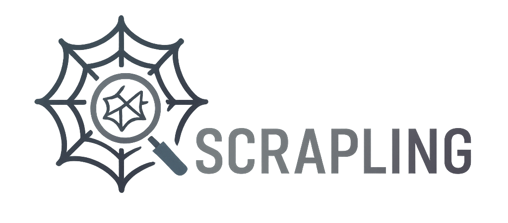

<style>
.md-typeset h1 {
  display: none;
}
</style>

<div align="center">
    <a href="https://scrapling.readthedocs.io/en/latest/" alt="poster">
        </a>
</div>

<div align="center">
    <i><code>Easy, effortless Web Scraping as it should be!</code></i>
    <br/><br/>
</div>

**Stop fighting anti-bot systems. Stop rewriting selectors after every website update.**

Scrapling isn't just another Web Scraping library. It's the first **adaptive** scraping library that learns from website changes and evolves with them. While other libraries break when websites update their structure, Scrapling automatically relocates your elements and keeps your scrapers running.

Built for the modern Web, Scrapling has its own rapid parsing engine and its fetchers to handle all Web Scraping challenges you are facing or will face. Built by Web Scrapers for Web Scrapers and regular users, there's something for everyone.

```python
>> from scrapling.fetchers import Fetcher, AsyncFetcher, StealthyFetcher, DynamicFetcher
>> StealthyFetcher.adaptive = True
# Fetch websites' source under the radar!
>> page = StealthyFetcher.fetch('https://example.com', headless=True, network_idle=True)
>> print(page.status)
200
>> products = page.css('.product', auto_save=True)  # Scrape data that survives website design changes!
>> # Later, if the website structure changes, pass `adaptive=True`
>> products = page.css('.product', adaptive=True)  # and Scrapling still finds them!
```

## Top Sponsors 

<!-- sponsors -->
<div style="text-align: center;">
  <a href="https://evomi.com?utm_source=github&utm_medium=banner&utm_campaign=d4vinci-scrapling" target="_blank" title="Evomi is your Swiss Quality Proxy Provider, starting at $0.49/GB"></a>
  <a href="https://petrosky.io/d4vinci" target="_blank" title="PetroSky delivers cutting-edge VPS hosting."></a>
</div>
<!-- /sponsors -->

<i><sub>Do you want to show your ad here? Click [here](https://github.com/sponsors/D4Vinci/sponsorships?tier_id=435495) and enjoy the rest of the perks!</sub></i>

## Key Features

### Advanced Websites Fetching with Session Support
- **HTTP Requests**: Fast and stealthy HTTP requests with the `Fetcher` class. Can impersonate browsers' TLS fingerprint, headers, and use HTTP/3.
- **Dynamic Loading**: Fetch dynamic websites with full browser automation through the `DynamicFetcher` class supporting Playwright's Chromium, real Chrome, and custom stealth mode.
- **Anti-bot Bypass**: Advanced stealth capabilities with `StealthyFetcher` using a modified version of Firefox and fingerprint spoofing. Can bypass all levels of Cloudflare's Turnstile with automation easily.
- **Session Management**: Persistent session support with `FetcherSession`, `StealthySession`, and `DynamicSession` classes for cookie and state management across requests.
- **Async Support**: Complete async support across all fetchers and dedicated async session classes.

### Adaptive Scraping & AI Integration
- 🔄 **Smart Element Tracking**: Relocate elements after website changes using intelligent similarity algorithms.
- 🎯 **Smart Flexible Selection**: CSS selectors, XPath selectors, filter-based search, text search, regex search, and more. 
- 🔍 **Find Similar Elements**: Automatically locate elements similar to found elements.
- 🤖 **MCP Server to be used with AI**: Built-in MCP server for AI-assisted Web Scraping and data extraction. The MCP server features custom, powerful capabilities that utilize Scrapling to extract targeted content before passing it to the AI (Claude/Cursor/etc), thereby speeding up operations and reducing costs by minimizing token usage.

### High-Performance & battle-tested Architecture
- 🚀 **Lightning Fast**: Optimized performance outperforming most Python scraping libraries.
- 🔋 **Memory Efficient**: Optimized data structures and lazy loading for a minimal memory footprint.
- ⚡ **Fast JSON Serialization**: 10x faster than the standard library.
- 🏗️ **Battle tested**: Not only does Scrapling have 92% test coverage and full type hints coverage, but it has been used daily by hundreds of Web Scrapers over the past year.

### Developer/Web Scraper Friendly Experience
- 🎯 **Interactive Web Scraping Shell**: Optional built-in IPython shell with Scrapling integration, shortcuts, and new tools to speed up Web Scraping scripts development, like converting curl requests to Scrapling requests and viewing requests results in your browser.
- 🚀 **Use it directly from the Terminal**: Optionally, you can use Scrapling to scrape a URL without writing a single code!
- 🛠️ **Rich Navigation API**: Advanced DOM traversal with parent, sibling, and child navigation methods.
- 🧬 **Enhanced Text Processing**: Built-in regex, cleaning methods, and optimized string operations.
- 📝 **Auto Selector Generation**: Generate robust CSS/XPath selectors for any element.
- 🔌 **Familiar API**: Similar to Scrapy/BeautifulSoup with the same pseudo-elements used in Scrapy/Parsel.
- 📘 **Complete Type Coverage**: Full type hints for excellent IDE support and code completion.


## Star History
Scrapling’s GitHub stars have grown steadily since its release (see chart below).

<div id="chartContainer">
  <a href="https://github.com/D4Vinci/Scrapling">
    
  </a>
</div>

<script>
const observer = new MutationObserver((mutations) => {
  mutations.forEach((mutation) => {
    if (mutation.attributeName === 'data-md-color-media') {
      const colorMedia = document.body.getAttribute('data-md-color-media');
      const isDarkScheme = document.body.getAttribute('data-md-color-scheme') === 'slate';
      const chartImg = document.querySelector('#chartImage');
      const baseUrl = 'https://api.star-history.com/svg?repos=D4Vinci/Scrapling&type=Date';
      
      if (colorMedia === '(prefers-color-scheme)' ? isDarkScheme : colorMedia.includes('dark')) {
        chartImg.src = `${baseUrl}&theme=dark`;
      } else {
        chartImg.src = baseUrl;
      }
    }
  });
});

observer.observe(document.body, {
  attributes: true,
  attributeFilter: ['data-md-color-media', 'data-md-color-scheme']
});
</script>

## Installation
Scrapling requires Python 3.10 or higher:

```bash
pip install scrapling
```

#### Fetchers Setup

If you are going to use any of the fetchers or their session classes, then install browser dependencies with
```bash
scrapling install
```

This downloads all browsers with their system dependencies and fingerprint manipulation dependencies.

### Optional Dependencies

- Install the MCP server feature:
```bash
pip install "scrapling[ai]"
```
- Install shell features (Web Scraping shell and the `extract` command): 
```bash
pip install "scrapling[shell]"
```
- Install everything: 
```bash
pip install "scrapling[all]"
```

## How the documentation is organized
Scrapling has a lot of documentation, so we try to follow a guideline called the [Diátaxis documentation framework](https://diataxis.fr/).

## Support

If you like Scrapling and want to support its development:

- ⭐ Star the [GitHub repository](https://github.com/D4Vinci/Scrapling)
- 🚀 Follow us on [Twitter](https://x.com/Scrapling_dev) and join the [discord server](https://discord.gg/EMgGbDceNQ)
- 💝 Consider [sponsoring the project or buying me a coffee](donate.md) :wink:
- 🐛 Report bugs and suggest features through [GitHub Issues](https://github.com/D4Vinci/Scrapling/issues)

## License

This project is licensed under the BSD-3 License. See the [LICENSE](https://github.com/D4Vinci/Scrapling/blob/main/LICENSE) file for details.