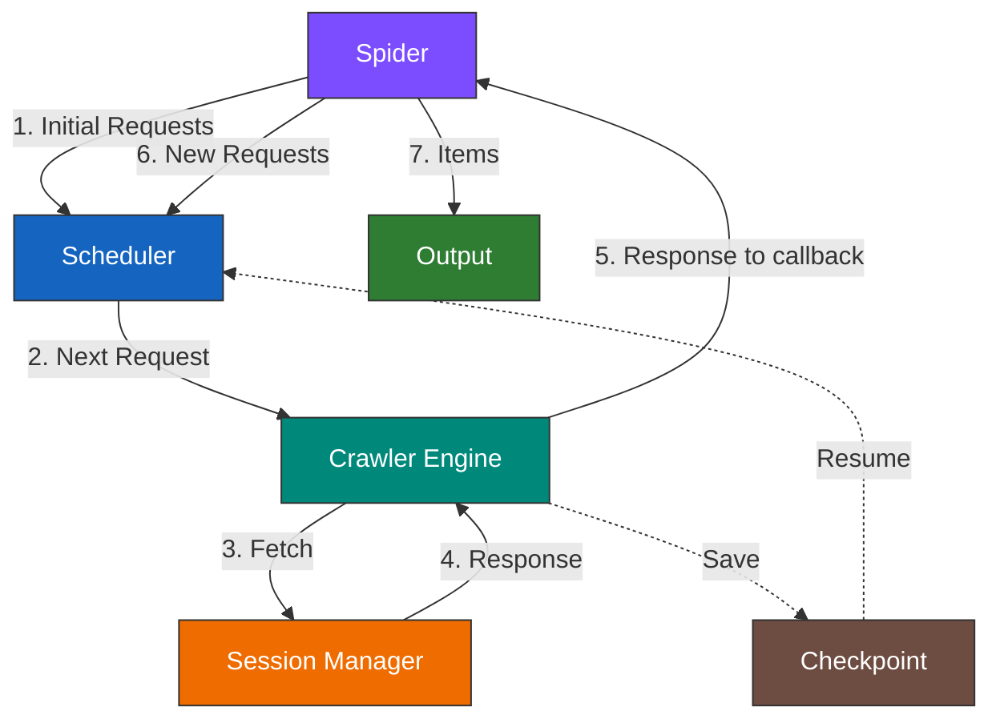

## Introduction

!!! success "Prerequisites"

    1. You've completed or read the [Fetchers basics](../fetching/choosing.md) page to understand the different fetcher types and when to use each one.
    2. You've completed or read the [Main classes](../parsing/main_classes.md) page to understand the [Selector](../parsing/main_classes.md#selector) and [Response](../fetching/choosing.md#response-object) classes.

Scrapling's spider system is a Scrapy-inspired async crawling framework designed for concurrent, multi-session crawls with built-in pause/resume support. It brings together Scrapling's parsing engine and fetchers into a unified crawling API while adding scheduling, concurrency control, and checkpointing.

If you're familiar with Scrapy, you'll feel right at home. If not, don't worry — the system is designed to be straightforward.

## Data Flow

The diagram below shows how data flows through the spider system when a crawl is running:



Here's what happens step by step when you run a spider without many details:

1. The **Spider** produces the first batch of `Request` objects. By default, it creates one request for each URL in `start_urls`, but you can override `start_requests()` for custom logic.
2. The **Scheduler** receives requests and places them in a priority queue, and creates fingerprints for them. Higher-priority requests are dequeued first.
3. The **Crawler Engine** asks the **Scheduler** to dequeue the next request, respecting concurrency limits (global and per-domain) and download delays. Once the **Crawler Engine** receives the request, it passes it to the **Session Manager**, which routes it to the correct session based on the request's `sid` (session ID).
4. The **session** fetches the page and returns a [Response](../fetching/choosing.md#response-object) object to the **Crawler Engine**. The engine records statistics and checks for blocked responses. If the response is blocked, the engine retries the request up to `max_blocked_retries` times. Of course, the blocking detection and the retry logic for blocked requests can be customized.
5. The **Crawler Engine** passes the [Response](../fetching/choosing.md#response-object) to the request's callback. The callback either yields a dictionary, which gets treated as a scraped item, or a follow-up request, which gets sent to the scheduler for queuing.
6. The cycle repeats from step 2 until the scheduler is empty and no tasks are active, or the spider is paused.
7. If `crawldir` is set while starting the spider, the **Crawler Engine** periodically saves a checkpoint (pending requests + seen URLs set) to disk. On graceful shutdown (Ctrl+C), a final checkpoint is saved. The next time the spider runs with the same `crawldir`, it resumes from where it left off — skipping `start_requests()` and restoring the scheduler state.


## Components

### Spider

The central class you interact with. You subclass `Spider`, define your `start_urls` and `parse()` method, and optionally configure sessions and override lifecycle hooks.

```python
from scrapling.spiders import Spider, Response, Request

class MySpider(Spider):
    name = "my_spider"
    start_urls = ["https://example.com"]

    async def parse(self, response: Response):
        for link in response.css("a::attr(href)").getall():
            yield response.follow(link, callback=self.parse_page)

    async def parse_page(self, response: Response):
        yield {"title": response.css("h1::text").get("")}
```

### Crawler Engine

The engine orchestrates the entire crawl. It manages the main loop, enforces concurrency limits, dispatches requests through the Session Manager, and processes results from callbacks. You don't interact with it directly — the `Spider.start()` and `Spider.stream()` methods handle it for you.

### Scheduler

A priority queue with built-in URL deduplication. Requests are fingerprinted based on their URL, HTTP method, body, and session ID. The scheduler supports `snapshot()` and `restore()` for the checkpoint system, allowing the crawl state to be saved and resumed.

### Session Manager

Manages one or more named session instances. Each session is one of:

- [FetcherSession](../fetching/static.md)
- [AsyncDynamicSession](../fetching/dynamic.md)
- [AsyncStealthySession](../fetching/stealthy.md)

When a request comes in, the Session Manager routes it to the correct session based on the request's `sid` field. Sessions can be started with the spider start (default) or lazily (started on the first use).

### Checkpoint System

An optional system that, if enabled, saves the crawler's state (pending requests + seen URL fingerprints) to a pickle file on disk. Writes are atomic (temp file + rename) to prevent corruption. Checkpoints are saved periodically at a configurable interval and on graceful shutdown. Upon successful completion (not paused), checkpoint files are automatically cleaned up.

### Output

Scraped items are collected in an `ItemList` (a list subclass with `to_json()` and `to_jsonl()` export methods). Crawl statistics are tracked in a `CrawlStats` dataclass which contains a lot of useful info.


## Comparison with Scrapy

If you're coming from Scrapy, here's how Scrapling's spider system maps:

| Concept            | Scrapy                        | Scrapling                                                       |
|--------------------|-------------------------------|-----------------------------------------------------------------|
| Spider definition  | `scrapy.Spider` subclass      | `scrapling.spiders.Spider` subclass                             |
| Initial requests   | `start_requests()`            | `async start_requests()`                                        |
| Callbacks          | `def parse(self, response)`   | `async def parse(self, response)`                               |
| Following links    | `response.follow(url)`        | `response.follow(url)`                                          |
| Item output        | `yield dict` or `yield Item`  | `yield dict`                                                    |
| Request scheduling | Scheduler + Dupefilter        | Scheduler with built-in deduplication                           |
| Downloading        | Downloader + Middlewares      | Session Manager with multi-session support                      |
| Item processing    | Item Pipelines                | `on_scraped_item()` hook                                        |
| Blocked detection  | Through custom middlewares    | Built-in `is_blocked()` + `retry_blocked_request()` hooks       |
| Concurrency        | `CONCURRENT_REQUESTS` setting | `concurrent_requests` class attribute                           |
| Domain filtering   | `allowed_domains`             | `allowed_domains`                                               |
| Pause/Resume       | `JOBDIR` setting              | `crawldir` constructor argument                                 |
| Export             | Feed exports                  | `result.items.to_json()` / `to_jsonl()` or custom through hooks |
| Running            | `scrapy crawl spider_name`    | `MySpider().start()`                                            |
| Streaming          | N/A                           | `async for item in spider.stream()`                             |
| Multi-session      | N/A                           | Multiple sessions with different types per spider               |