## Introduction

!!! success "Prerequisites"

    1. You've completed or read the [Fetchers basics](../fetching/choosing.md) page to understand the different fetcher types and when to use each one.
    2. You've completed or read the [Main classes](../parsing/main_classes.md) page to understand the [Selector](../parsing/main_classes.md#selector) and [Response](../fetching/choosing.md#response-object) classes.

Scrapling's spider system is a Scrapy-inspired async crawling framework designed for concurrent, multi-session crawls with built-in pause/resume support. It brings together Scrapling's parsing engine and fetchers into a unified crawling API while adding scheduling, concurrency control, and checkpointing.

If you're familiar with Scrapy, you'll feel right at home. If not, don't worry — the system is designed to be straightforward.

## Architecture Overview

The diagram below shows how data flows through the spider system when a crawl is running:

```mermaid
graph TB
    subgraph Spider["🕷️ Spider"]
        direction TB
        SR["start_requests()"]
        Parse["parse() / callbacks"]
        Hooks["Lifecycle hooks<br/><small>on_start · on_close · on_error<br/>is_blocked · on_scraped_item</small>"]
    end

    subgraph Engine["⚙️ Crawler Engine"]
        direction TB
        Loop["Crawl loop"]
        Conc["Concurrency control<br/><small>Global limiter · Per-domain limiter<br/>Download delay</small>"]
        BlockDet["Blocked request<br/>detection & retry"]
    end

    subgraph Scheduler["📋 Scheduler"]
        PQ["Priority queue"]
        Dedup["Fingerprint<br/>deduplication"]
    end

    subgraph SessionMgr["🔌 Session Manager"]
        direction TB
        Router["Request router<br/><small>Routes by session ID</small>"]
        subgraph Sessions["Sessions"]
            direction LR
            HTTP["FetcherSession<br/><small>HTTP requests</small>"]
            Dynamic["AsyncDynamicSession<br/><small>Browser automation</small>"]
            Stealth["AsyncStealthySession<br/><small>Anti-bot bypass</small>"]
        end
    end

    subgraph Output["📦 Output"]
        Items["ItemList<br/><small>to_json() · to_jsonl()</small>"]
        Stream["Streaming<br/><small>async for item in spider.stream()</small>"]
        Stats["CrawlStats"]
    end

    Checkpoint["💾 Checkpoint<br/><small>Pause/Resume</small>"]

    %% Data flow
    SR -- "1. Initial<br/>Requests" --> Scheduler
    Scheduler -- "2. Next<br/>Request" --> Engine
    Engine -- "3. Fetch" --> SessionMgr
    Router --> Sessions
    SessionMgr -- "4. Response" --> Engine
    Engine -- "5. Response" --> Parse
    Parse -- "6a. New Requests" --> Scheduler
    Parse -- "6b. Items (dict)" --> Output
    Engine -. "Periodic save" .-> Checkpoint
    Checkpoint -. "Resume" .-> Scheduler

    %% Styling
    classDef spiderClass fill:#7c4dff,stroke:#333,color:#fff
    classDef engineClass fill:#00897b,stroke:#333,color:#fff
    classDef schedulerClass fill:#1565c0,stroke:#333,color:#fff
    classDef sessionClass fill:#ef6c00,stroke:#333,color:#fff
    classDef outputClass fill:#2e7d32,stroke:#333,color:#fff
    classDef checkpointClass fill:#6d4c41,stroke:#333,color:#fff

    class Spider spiderClass
    class Engine engineClass
    class Scheduler schedulerClass
    class SessionMgr sessionClass
    class Output outputClass
    class Checkpoint checkpointClass
```



## Data Flow

Here's what happens step by step when you run a spider:

### 1. Spider generates initial Requests

The **Spider** produces the first batch of `Request` objects. By default, it creates one request for each URL in `start_urls`, but you can override `start_requests()` for custom logic (e.g., POST requests, authentication, different callbacks).

### 2. Requests are scheduled

The **Scheduler** receives requests and places them in a priority queue. Before queuing, each request gets a fingerprint (SHA1 hash of URL + method + body + session ID). Duplicate requests are silently dropped unless `dont_filter=True` is set on the request. Higher-priority requests are dequeued first.

### 3. Engine fetches via Session Manager

The **Crawler Engine** dequeues the next request, respecting concurrency limits (global and per-domain) and download delays. It then hands the request to the **Session Manager**, which routes it to the correct session based on the request's `sid` (session ID).

A spider can have multiple sessions running simultaneously — for example, a fast `FetcherSession` for simple pages and a `AsyncStealthySession` for protected pages. The Session Manager handles starting, routing, and closing all of them.

### 4. Response comes back

The session fetches the page and returns a `Response` object. The engine records statistics (response bytes, status codes, per-session request counts) and checks for blocked responses.

If the response is blocked (determined by `is_blocked()`), the engine retries the request up to `max_blocked_retries` times, calling `retry_blocked_request()` so you can modify the request before retrying (e.g., switch proxies, add headers).

### 5. Spider processes the Response

The engine passes the `Response` to the spider's callback (default: `parse()`). The callback is an async generator that yields results.

### 6. Results are routed

The callback can yield three types of values:

- **`dict`** — Treated as a scraped item. Passed through `on_scraped_item()` for processing/filtering (return `None` to drop it), then added to the `ItemList` or streamed to the consumer.
- **`Request`** — A follow-up request. Checked against `allowed_domains`, normalized, and sent to the Scheduler for queuing.
- **`None`** — Silently ignored.

The cycle repeats from step 2 until the scheduler is empty and no tasks are active, or the spider is paused.

### Checkpointing

If `crawldir` is set, the engine periodically saves a checkpoint (pending requests + seen URLs set) to disk. On graceful shutdown (Ctrl+C), a final checkpoint is saved. The next time the spider runs with the same `crawldir`, it resumes from where it left off — skipping `start_requests()` and restoring the scheduler state.


## Components

### Spider

The central class you interact with. You subclass `Spider`, define your `start_urls` and `parse()` method, and optionally configure sessions and override lifecycle hooks.

```python
from scrapling.spiders import Spider, Response, Request

class MySpider(Spider):
    name = "my_spider"
    start_urls = ["https://example.com"]

    async def parse(self, response: Response):
        for link in response.css("a::attr(href)").getall():
            yield response.follow(link, callback=self.parse_page)

    async def parse_page(self, response: Response):
        yield {"title": response.css("h1::text").get("")}
```

### Crawler Engine

The engine orchestrates the entire crawl. It manages the main loop, enforces concurrency limits using `anyio` task groups and `CapacityLimiter`, dispatches requests through the Session Manager, and processes results from callbacks. You don't interact with it directly — the `Spider.start()` and `Spider.stream()` methods handle it for you.

### Scheduler

A priority queue with built-in URL deduplication. Requests are fingerprinted based on their URL, HTTP method, body, and session ID. The scheduler supports `snapshot()` and `restore()` for the checkpoint system, allowing the crawl state to be saved and resumed.

### Session Manager

Manages one or more named session instances. Each session is one of:

- **`FetcherSession`** — Async HTTP requests via `curl_cffi` (fastest, no JavaScript)
- **`AsyncDynamicSession`** — Playwright browser automation (JavaScript support)
- **`AsyncStealthySession`** — Stealthy browser with anti-bot bypass (Cloudflare, etc.)

When a request comes in, the Session Manager routes it to the correct session based on the request's `sid` field. Sessions can be started eagerly (default) or lazily (started on first use).

### Checkpoint System

Saves the crawler's state (pending requests + seen URL fingerprints) to a pickle file on disk. Writes are atomic (temp file + rename) to prevent corruption. Checkpoints are saved periodically at a configurable interval and on graceful shutdown. On successful completion (not paused), checkpoint files are cleaned up automatically.

### Output

Scraped items are collected in an `ItemList` (a list subclass with `to_json()` and `to_jsonl()` export methods). Crawl statistics are tracked in a `CrawlStats` dataclass with per-domain bytes, per-session request counts, status code distribution, and timing information.


## Comparison with Scrapy

If you're coming from Scrapy, here's how Scrapling's spider system maps:

| Concept | Scrapy | Scrapling |
|---------|--------|-----------|
| Spider definition | `scrapy.Spider` subclass | `scrapling.spiders.Spider` subclass |
| Initial requests | `start_requests()` | `start_requests()` |
| Callbacks | `def parse(self, response)` | `async def parse(self, response)` |
| Following links | `response.follow(url)` | `response.follow(url)` |
| Item output | `yield dict` or `yield Item` | `yield dict` |
| Request scheduling | Scheduler + Dupefilter | Scheduler with built-in deduplication |
| Downloading | Downloader + Middlewares | Session Manager with multi-session support |
| Item processing | Item Pipelines | `on_scraped_item()` hook |
| Blocked detection | Custom middlewares | Built-in `is_blocked()` + `retry_blocked_request()` |
| Concurrency | `CONCURRENT_REQUESTS` setting | `concurrent_requests` class attribute |
| Domain filtering | `allowed_domains` | `allowed_domains` |
| Pause/Resume | `JOBDIR` setting | `crawldir` constructor argument |
| Export | Feed exports | `result.items.to_json()` / `to_jsonl()` |
| Running | `scrapy crawl spider_name` | `MySpider().start()` |
| Streaming | N/A | `async for item in spider.stream()` |
| Multi-session | N/A | Multiple fetcher sessions per spider |
